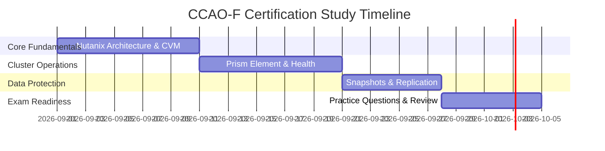

# Nutanix CCAO-F (Nutanix Certified Associate - Multicloud Infrastructure) Guide

---

## 10 Sample Practice Questions

#### Q1: What is the primary management interface for a single Nutanix cluster?
- A) Prism Element
- B) Windows vSphere Client
- C) Command Prompt
- D) Putty Terminal
* **Correct Answer**: A
* **Explanation**: Prism Element is the built-in web console for managing an individual Nutanix cluster.

#### Q2: In Nutanix hyperconverged storage, what is the Controller VM (CVM)?
- A) A specialized VM running on each cluster node that virtualizes local storage drives into a unified pool
- B) A graphics design program
- C) An external third-party backup server
- D) A web browser extension
* **Correct Answer**: A
* **Explanation**: The CVM manages local storage disks and participates in the Distributed Storage Fabric (DSF).

#### Q3: What is the default hypervisor option built natively into Nutanix HCI?
- A) Nutanix AHV
- B) Hyper-V
- C) XenServer
- D) VirtualBox
* **Correct Answer**: A
* **Explanation**: Nutanix AHV is a license-free, enterprise-grade hypervisor built on open-source KVM technology.

#### Q4: What does Replication Factor 2 (RF2) ensure in a Nutanix cluster?
- A) Two copy replicas of data are written across separate physical nodes to tolerate a single host failure
- B) Data is stored on 2 USB drives
- C) Network bandwidth is doubled
- D) Two users can log in simultaneously
* **Correct Answer**: A
* **Explanation**: RF2 writes two copies of every block across different nodes, ensuring zero data loss during a single node failure.

#### Q5: What is the function of Nutanix Storage Containers?
- A) Logical software abstractions created within a storage pool to apply compression, deduplication, and RF policies
- B) Physical shipping containers
- C) RAM memory chips
- D) Desktop background wallpapers
* **Correct Answer**: A
* **Explanation**: Storage containers hold VM disk files (vDisks) and apply storage efficiency settings like inline compression.

#### Q6: How does Nutanix Prism Alert system inform administrators of hardware issues?
- A) Generating color-coded health status alerts (Info, Warning, Critical) with automatic RCA details
- B) Sending fax messages
- C) Turning off node power
- D) Deleting VM files
* **Correct Answer**: A
* **Explanation**: Prism proactively monitors system health counters and generates actionable alerts for administrative remediation.

#### Q7: What function does Nutanix Pulse perform?
- A) Transmitting diagnostic health telemetry securely to Nutanix Support for proactive assistance
- B) Measuring employee heart rates
- C) Cleaning system temporary files
- D) Printing reports
* **Correct Answer**: A
* **Explanation**: Pulse is Nutanix's automated call-home telemetry feature that enables proactive support ticket generation.

#### Q8: What is a Nutanix Storage Pool?
- A) A aggregation of physical storage devices (SSDs/HDDs) across all nodes in a cluster
- B) A database table
- C) A public cloud account
- D) A network switch port
* **Correct Answer**: A
* **Explanation**: Storage pools group physical drives across the cluster nodes into one scalable storage capacity pool.

#### Q9: What feature in Nutanix AHV allows live migration of a running VM from one host to another?
- A) Live Migration / Acropolis Dynamic Scheduling (ADS)
- B) Reboot
- C) File Download
- D) Hard Reset
* **Correct Answer**: A
* **Explanation**: AHV supports seamless live migration of active workloads between cluster hosts without downtime.

#### Q10: How can an administrator expand a Nutanix cluster's compute and storage capacity?
- A) Using the "Add Node" wizard in Prism Element to auto-discover and integrate a new node into the cluster
- B) Reformatting the cluster
- C) Buying a new domain name
- D) Reinstalling Windows OS
* **Correct Answer**: A
* **Explanation**: The Add Node workflow in Prism automatically provisions, configures, and adds new nodes to the active cluster.

---

## Domain Overview

| Knowledge Area | Core Topics | Weight |
| :--- | :--- | :--- |
| **Nutanix Core Concepts** | CVM, DSF, AHV, RF2/RF3 | 35% |
| **Cluster Management** | Prism Element, Storage Containers, Health | 30% |
| **Cluster Maintenance** | Adding Nodes, Upgrades, Pulse | 20% |
| **Data Protection** | Local Snapshots, Async Replication | 15% |

---

## Examination Strategy

When preparing for your exam, validate your understanding using the [CCAO-F certification exam](https://www.certsclub.com) practice questions to ensure readiness across all Nutanix Associate domains.
